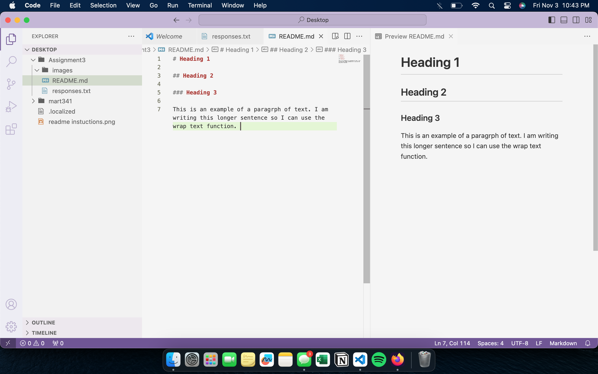

# Heading 1

## Heading 2

### Heading 3

This is an example of a paragrph of text. I am writing this longer sentence so I can use the wrap text function. 

[Click Here](https://www.google.com)

[My File](./responses.txt)

